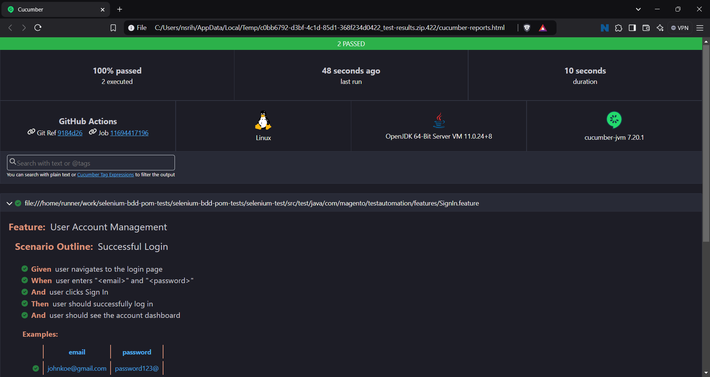

# Selenium Test Automation Project Using BDD and POM

This project is a robust Selenium-based test automation framework designed for testing user account management functionalities, including login and sign-up processes. It employs **Behavior Driven Development (BDD)** using Cucumber to define test scenarios in a human-readable format. Additionally, the framework incorporates the **Page Object Model (POM)** design pattern, promoting code reusability and maintainability by encapsulating the interactions with web pages in dedicated classes.

This project aims to enhance the reliability and efficiency of testing processes while providing clear and maintainable test cases that align with business requirements.

## Test Results Generated from Successful GitHub Actions Integration



## Features

- **User Login**: Tests the successful login of users with valid credentials.
- **User Sign Up**: Tests the successful account creation process with valid user details.
- **Invalid Login Attempt**: Verifies that an error message is displayed when invalid credentials are entered.
- **Logout Functionality**: Tests the ability of the user to log out successfully.
- **Duplicate Email Check**: Verifies that the system prevents duplicate email addresses during account creation.
- **Password Strength Validation**: Ensures that the system enforces strong password requirements during sign-up.
- **Headless Browser Testing**: Runs tests in a headless browser environment for CI/CD integration.

## Technologies Used

- **Java**: The primary programming language used in this project.
- **Selenium**: A powerful tool for web browser automation.
- **Cucumber**: A BDD framework for writing test scenarios in Gherkin syntax.
- **JUnit**: For running tests and assertions.
- **Maven**: For dependency management and project build automation.
- **GitHub Actions**: For Continuous Integration and Continuous Deployment (CI/CD).

## Getting Started

### Prerequisites

- Java 11
- Maven

### Installation

1. Clone the repository:
   ```bash
   git clone https://github.com/harsha123e/selenium-bdd-pom-tests.git
   cd selenium-bdd-pom-tests
   cd selenium-test
   ```

2. Install dependencies:
   ```bash
   mvn install
   ```

### Running Tests

To run the tests locally:

```bash
mvn test
```

To run the tests using headless browser locally:

```bash
mvn test -Dheadless=true
```

### CI/CD Integration

This project is set up with GitHub Actions for continuous integration. The tests will automatically run on every push or pull request to the `main` branch.

## Test Cases

| Test Case ID | Test Case Description             | Preconditions                     | Test Steps                                                                                                                                                  | Expected Result                                                              | Status |
|--------------|-----------------------------------|-----------------------------------|------------------------------------------------------------------------------------------------------------------------------------------------------------|------------------------------------------------------------------------------|--------|
| TC001        | Verify Successful Account Creation | User is on the sign-up page       | 1. Given user is on sign-up page.<br>2. When user enters valid user details.<br>3. Then user clicks "Create Account."                                       | User should see a confirmation message and be redirected to the account dashboard. | Pass   |
| TC002        | Verify Successful Login            | Account created from TC001        | 1. Given user is on login page.<br>2. When user enters valid credentials.<br>3. Then user clicks "Sign In."                                               | User should successfully log in and see the account dashboard.                 | Pass   |
| TC003        | Verify Invalid Login Attempt       | User is on the login page         | 1. Given user navigates to the login page.<br>2. When user enters invalid credentials email and password.<br>3. And clicks "Sign In."                    | User should see an error message indicating incorrect credentials.             | Pass   |
| TC004        | Verify Logout Functionality        | User is logged into their account | 1. Given user is logged into their account.<br>2. When user clicks on the logout button.                                                                   | User should be redirected to the sign-out page and no longer see the account dashboard. | Pass   |
| TC005        | Verify Duplicate Email Check       | User is on the sign-up page       | 1. Given user is on sign-up page.<br>2. When user enters valid details first name, last name, existing email, and password.<br>3. And clicks "Create Account." | User should see an error message indicating the email is already in use.      | Pass   |
| TC006        | Verify Password Strength Validation | User is on the sign-up page       | 1. Given user is on sign-up page.<br>2. When user enters first name, last name, email, and weak password.                                                  | User should see an error message indicating the password does not meet strength requirements. | Pass   |

## Acknowledgments

- [Selenium](https://www.selenium.dev/) - For providing the web automation framework.
- [Cucumber](https://cucumber.io/) - For the BDD framework.
- [JUnit](https://junit.org/) - For testing.

---